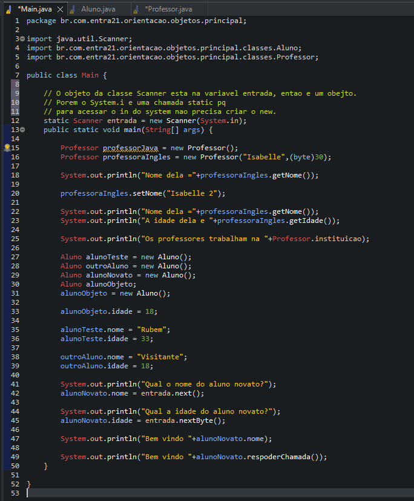
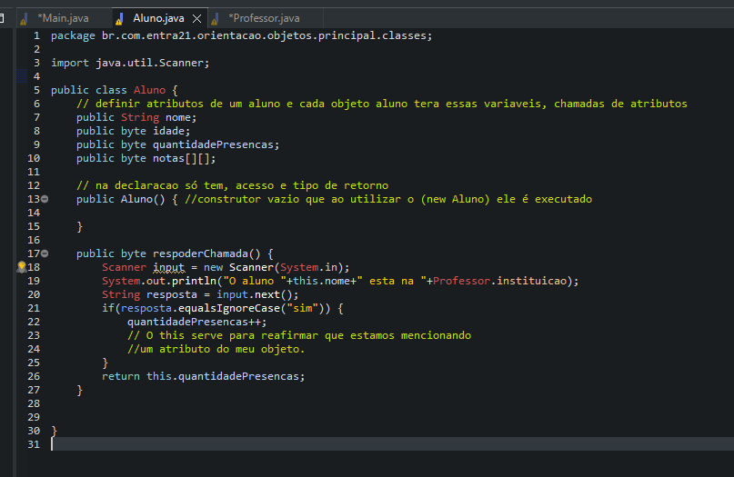
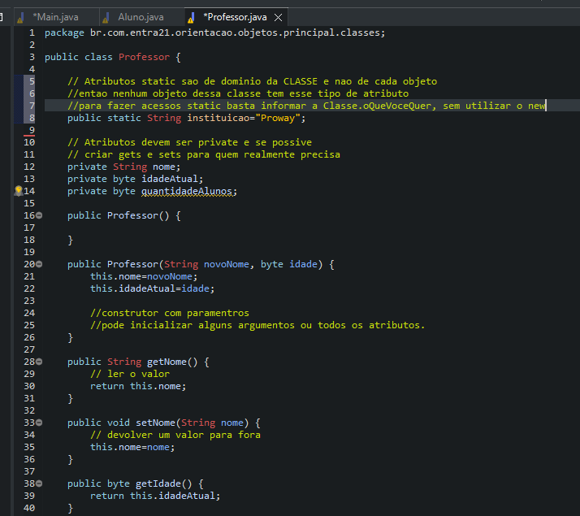

# Learning about Classes and Objects

## Classes are shapes that create objects.
- Classes can be called in 2 ways:
    - static where you don't need to give new to use the (dot) but only static items appear as an option.
    - object where to access the attributes and methods it is necessary to give new to create an object.

## Encapsulation
- It can be seen as a bureaucracy in the code, but it makes refactoring much easier with minimal or no impact for those who already consume the objects of this class.
- Changing the name of an attribute that is being accessed directly outside the class, requires that the attribute be adjusted outside that class as well. With the use of encapsulation, it is possible to change the change or reading privileges without impacting who consumes it, just change the implementation in the gets and sets.

## Examples 

- Main accessing Aluno and Professor

- Class Aluno

- Class Professor

