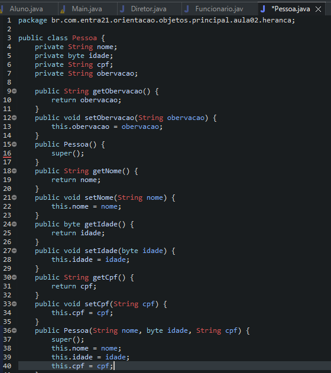
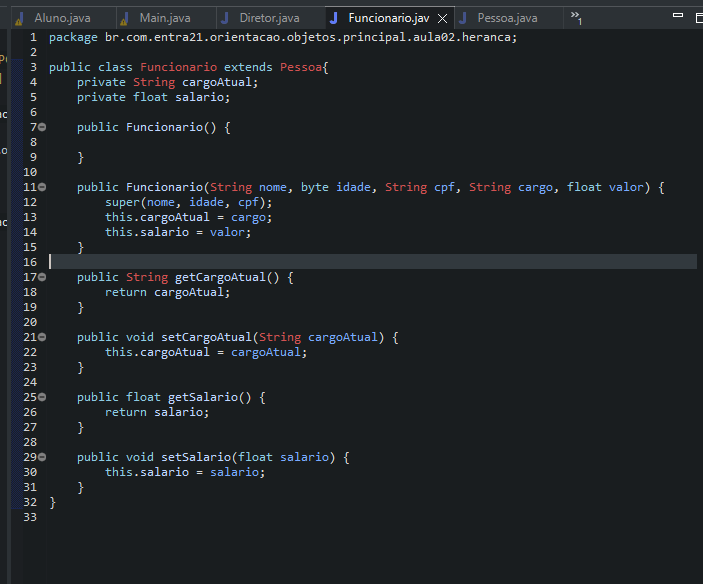

# Learning about Inheritance

- In Java, we can create classes that inherit attributes and methods from other classes, rewritten from code. This type of relationship is called Inheritance.
- To represent this type of relationship in the language, we must use an extended keyword, in order to define which class our new class should inherit its attributes and methods from.

## Examples 

- Funcionário using attributes of Pessoas.

