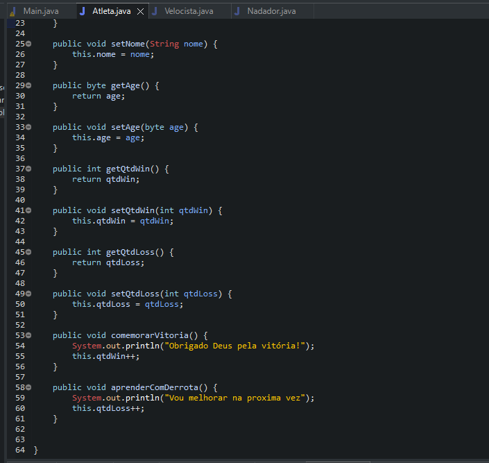

# Learning about Polymorphism

- Polymorphism is the principle by which two or more classes derived from the same superclass can invoke methods that have the same identification (signature) but different behaviors, specialized for each derived class, using a reference to an object of the superclass's type. The decision on which method should be selected, according to the type of the derived class, is made at runtime, through the late binding mechanism.

- In the case of polymorphism, it is necessary that the methods have exactly the same identification, using the method redefinition mechanism. This reset mechanism should not be confused with the method overload mechanism.

### Polymorphism means multiple forms

- Various ways to execute inherited behavior.
- Inheritance is needed to make the 3 basic forms of polymorphism.

1. Just take advantage of inherited behaviors
2. Completely make my way by writing an identical inheritance method.
3. Override "@Override" the inherited method - This way forces my overridden method to have the same syntax as the inheritance - I can take advantage of the inherited behavior with "super" and make a difference - I can take nothing and do it my way.

## Examples 

- Nadador, Velocista using attributes of Atleta.

