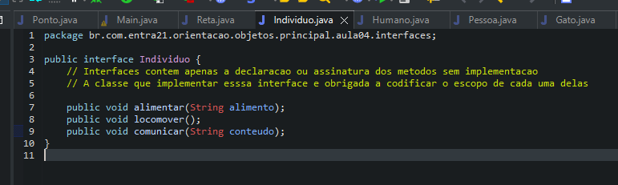
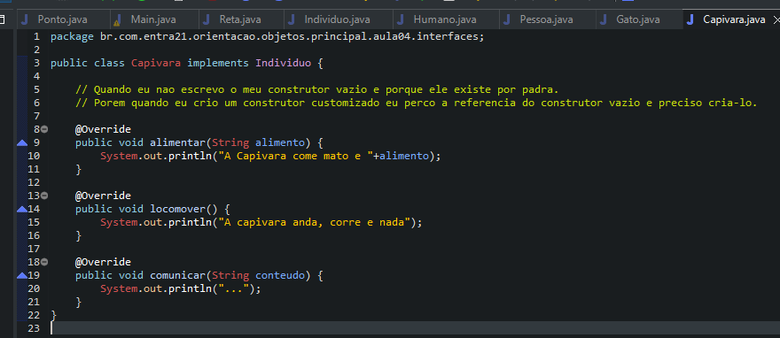

# Learning about Interfaces

- Polymorphism can be practiced with inheritance and with interfaces
With inheritance the methods are inherited by the super class and I have several options on how to deal with these inherited behaviors
     - Just enjoy the behaviors
     - Do it completely my way when creating the same behavior but with different execution
     - Override inherited behavior to run in 2 possible ways
         1. Leveraging legacy behavior and doing some add-on
         2. Completely do it my way
- With interfaces it will be necessary to create an element of type interface in the project and insert only the declaration of the methods without the implementation
- The difference is that the interfaces only list the behaviors and the classes that want to have these behaviors will be responsible for implementing the details.

## Examples 

- Class Capivara using the Individuo Interface

