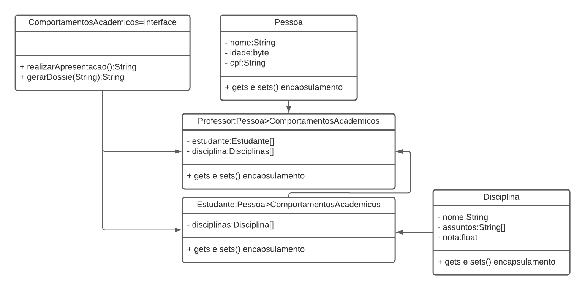

# Practice with all object-oriented concepts

- The entra21 program needs to manage the registration of students, professors, subjects, in order to send the dossiers to partner companies.
- The dossier must contain the data of the student , teacher and which subjects have been seen so far

### Entities
- The subject has a name, a list of subjects and a grade.
- Student has personal data, a list of subjects.
- Teacher has personal data and a list of students.
- All the people involved know how to communicate and have responsibilities, but each one does it in their own way.

## Examples 

- Diagram
